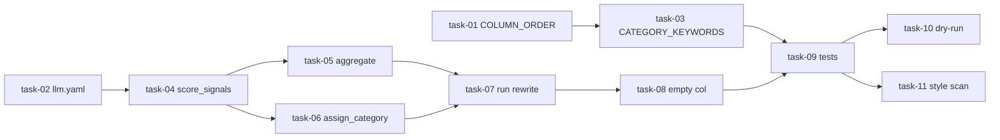

# 实现计划

## Wave 1（并行，无依赖）

- [ ] task-01: COLUMN_ORDER 三处同步加 🤖
- [ ] task-02: llm.yaml 新增 column-score call site

## Wave 2（依赖 Wave 1）

- [ ] task-03: CATEGORY_KEYWORDS 扩 🤖 词典 + 调 🚀（依赖 task-01）
- [ ] task-04: 实现 score_signals + Schema 校验（依赖 task-02）

## Wave 3（依赖 Wave 2，task-05/06 可并行）

- [ ] task-05: 实现 aggregate_scores（依赖 task-04）
- [ ] task-06: 实现 assign_category（方案 X 抢占）（依赖 task-04）

## Wave 4（依赖 Wave 3 全部完成）

- [ ] task-07: 重写 run() 评分链路 + legacy 降级（依赖 task-04, task-05, task-06）

## Wave 5（依赖 Wave 4）

- [ ] task-08: 空栏目消失 — run() 输出逻辑（依赖 task-07）

## Wave 6（依赖前面所有 task）

- [ ] task-09: 新增 tests/test_column_scoring.py（依赖 task-01~08）

## Wave 7（依赖 Wave 6，task-10/11 可并行）

- [ ] task-10: dry-run 集成验证（依赖 task-09）
- [ ] task-11: 风格一致性扫描（依赖 task-09）

## 依赖关系图

## 任务总表

| 编号 | 任务 | Wave | 优先级 | 依赖 | 覆盖 FR/D | 说明 |
|------|------|------|--------|------|-----------|------|
| task-01 | COLUMN_ORDER 三处同步加 🤖 | W1 | P0 | — | FR-05, D-012@v1, D-017@v1 | step4/7/8 三处常量加 `🤖 AI智能前沿` 于第 2 位 |
| task-02 | llm.yaml 新增 column-score call site | W1 | P0 | — | FR-10, D-002@v1, D-008@v1 | temp=0.0, max_tokens=256, timeout=30 |
| task-03 | CATEGORY_KEYWORDS 扩 🤖 + 调 🚀 | W2 | P0 | task-01 | FR-09, D-013@v1, D-014@v1 | 🤖 ≥30 词（厂商清单）；🚀 剥离 AI/智能制造、加 CPU/OS |
| task-04 | score_signals + Schema 校验 | W2 | P0 | task-02 | FR-01, FR-02, D-002@v1, D-011@v1, D-018@v1, D-019@v1 | LLM 单次 9 栏 JSON + _validate_signals |
| task-05 | aggregate_scores | W3 | P0 | task-04 | FR-03, D-003@v1, D-007@v1 | relev×(0.5+0.3·imp/10+0.2·time/10) |
| task-06 | assign_category（方案 X 抢占）| W3 | P0 | task-04 | FR-04, D-015@v1 | 🔬≥7→🔬，argmax 其余 |
| task-07 | 重写 run() 评分链路 + legacy 降级 | W4 | P0 | task-04, task-05, task-06 | FR-01, FR-07, FR-08, D-004@v1, D-006@v1, D-009@v1 | 主链路 + 二级降级 + 降级率监控 |
| task-08 | 空栏目消失 — run() 输出逻辑 | W5 | P1 | task-07 | FR-06, D-016@v1 | 只写有 items 的栏目 heading |
| task-09 | tests/test_column_scoring.py | W6 | P0 | task-01~08 | FR-11, all D-xxx@v1 | 单元测试覆盖全部 AC |
| task-10 | dry-run 集成验证 | W7 | P1 | task-09 | — | `step4.py --dry-run` / `time step4.py` |
| task-11 | 风格一致性扫描 | W7 | P2 | task-09 | D-010@v1 | rg type hints / typing / openai import |

## 关键路径

`task-02 → task-04 → task-05 → task-06 → task-07 → task-08 → task-09 → task-10`（8 步，关键路径）

## 全局验收标准

- `step4.py` 输出 `1新闻_链接.md` 含 9 栏 heading（🤖 在第 2 位），且空栏目不写 heading
- LLM 关闭时 step4 仍产出 top-10，走 legacy_path 不中断
- 12 条 AC-01~AC-12 全部通过
- step4.py / step7.py / step8.py 三处 COLUMN_ORDER 9 元素完全一致
- llm.yaml 含 `column-score` key，temperature=0.0
- CATEGORY_KEYWORDS 含 9 栏，🤖 词典 ≥30 词
- 实现代码无 type hints（`rg "->" step4.py` 无匹配）
- `run_all.sh` 不做改动（Phase 13 不改管道编排）
- 旧 8 栏 `1新闻_链接.md` 仍能被新 step7/step8 解析

## 覆盖矩阵

| 决策 ID | 覆盖任务 | 验收证据 |
|---------|----------|----------|
| D-001@v1 | task-01~11 | Phase 13 总范围 |
| D-002@v1 | task-04 | B+ 信号提取式骨架 |
| D-003@v1 | task-05 | 聚合公式 |
| D-004@v1 | task-07 | 必降级 + 监控 |
| D-005@v1 | (frontmatter) | 变更名 |
| D-006@v1 | task-07 | 保留 llm_classify_single |
| D-007@v1 | task-05 | 系数不外置 |
| D-008@v1 | task-02 | temp=0.0 |
| D-009@v1 | task-07 | 二级降级 |
| D-010@v1 | task-11 | 无 type hints |
| D-011@v1 | task-04 (prompt) | §4.0 语义契约 |
| D-012@v1 | task-01, task-07 | 新增 🤖 第 9 栏 |
| D-013@v1 | task-03 | 🤖 T2 厂商列举 |
| D-014@v1 | task-03 | 🚀 重切 + CPU 厂商列举 |
| D-015@v1 | task-06 | 方案 X 抢占 |
| D-016@v1 | task-08 | 空栏目消失 |
| D-017@v1 | task-01 | step7/8 同步常量 |
| D-018@v1 | task-04 (prompt) | 🔬 E 三维判定 |
| D-019@v1 | task-04 (prompt) | 🔬 D.1/D.2 拆分 |
