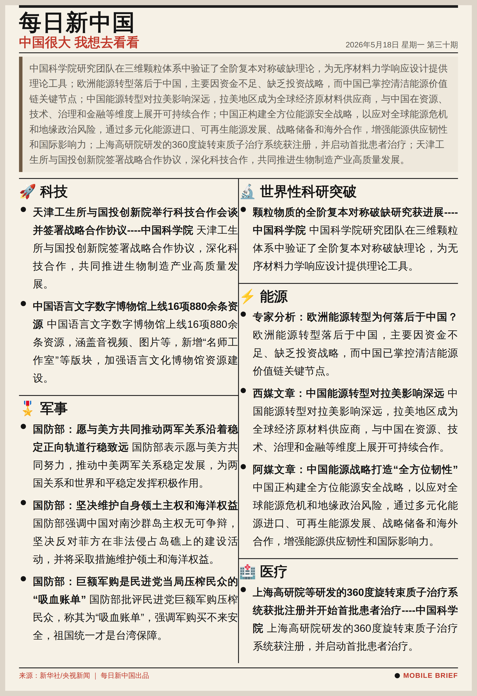

# 每日新中国 · Daily China News

> **中国很大 我想去看看** · *China is vast — let's take a look*

自动采集、筛选、分类、摘要、渲染全流程的「每日新中国」手机报纸。每天从 7 个中国权威信源采集当日新闻，经 LLM 摘要生成，渲染为 1080px 宽版手机壁纸风格报纸。

A fully automated Chinese news digest pipeline: collect → filter → classify → summarize → render. Produces a 1080px-wide mobile wallpaper-style newspaper every day.

---



---

## 目录 · Contents

- [这是什么 · What This Is](#这是什么--what-this-is)
- [管线 · Pipeline](#管线--pipeline)
- [栏目 · Columns](#栏目--columns)
- [技术栈 · Tech Stack](#技术栈--tech-stack)
- [快速开始 · Quick Start](#快速开始--quick-start)
- [每日运行 · Daily Usage](#每日运行--daily-usage)
- [示例输出 · Sample Output](#示例输出--sample-output)
- [项目结构 · Project Structure](#项目结构--project-structure)
- [许可 · License](#许可--license)

---

## 这是什么 · What This Is

**中文**

「每日新中国」是一个 100% 确定性的 Python 新闻处理管道。它从新华社、人民日报、央视、参考消息、中国科学院等 7 个中国权威信源采集当日新闻，经过 **三淘汰验证**（HTTP 状态、HTTPS 可达、内容有效性）、**涉华过滤**、**负面新闻过滤**，再通过关键词加权评分 + GLM-4 Flash LLM 双引擎分类到 8 个既定栏目。正文经 5 层策略链提取，由 LLM 逐条生成精炼摘要，最后渲染成手机壁纸风格的双栏中文报纸。

每个环节都是确定性的（LLM 调用有智能重试和回退），每天 10 条精选新闻，输出 HTML + PNG。

**English**

**Daily China News** is a deterministic Python pipeline that fetches, filters, and renders Chinese news as a mobile-friendly newspaper. Every day it collects ~200 articles from 7 authoritative Chinese sources (Xinhua, People's Daily, CCTV, Reference News, Chinese Academy of Sciences, etc.), filters through quality checks, China-relevance detection, and negative content removal, then classifies them into 8 curated columns using a hybrid keyword-weighting + GLM-4 Flash LLM engine.

Each article's body is extracted via a 5-layer strategy chain, summarized in 1-2 sentences by LLM with intelligent retry (diagnosis → fix prompt → retry up to 3x), and finally rendered as a dual-column CSS grid newspaper in HTML + PNG formats.

Every step is deterministic. Every day delivers exactly 10 curated articles.

---

## 管线 · Pipeline


---

## 栏目 · Columns

每日新中国将新闻归入 8 个栏目，每个栏目有独立的关键词权重体系。

*Daily China News classifies articles into 8 columns, each with its own keyword weighting system.*

| 栏目 Column | 关键词示例 Keywords | 权重范围 Weights |
|-------------|-------------------|-----------------|
| 🔬 世界性科研突破 · Scientific Breakthrough | 诺贝尔 · 基因 · 量子 · 航天 · 火星 | 1 - 5 |
| 🌾 农业 · Agriculture | 粮食 · 农田 · 农机 · 种植 · 养殖 | 1 - 3 |
| 🤝 扶贫 · Poverty Alleviation | 精准扶贫 · 易地搬迁 · 脱贫 | 3 - 5 |
| ⚡ 能源 · Energy | 核电 · 光伏 · 风电 · 氢能 · 清洁能源 | 1 - 4 |
| 🏥 医疗 · Healthcare | 疫苗 · 肿瘤 · 手术 · 医保 · 药物 | 1 - 3 |
| 🚀 科技 · Technology | AI · 机器人 · 芯片 · 算力 · 数据 | 1 - 3 |
| 🧱 材料 · Materials | 新材料 · 稀土 · 钢铁 · 化工 | 1 - 4 |
| 🎖️ 军事 · Military | 导弹 · 航母 · 军演 · 国防 · 战略 | 1 - 4 |

---

## 技术栈 · Tech Stack

| Component | Technology |
|-----------|-----------|
| **Language** | Python 3.12 — 5 scripts, ~2,000 LOC |
| **HTTP Fetching** | `urllib` static + `/snap/bin/chromium --dump-dom` (JS-rendered) |
| **Keyword Engine** | `CATEGORY_KEYWORDS` dictionary with per-keyword weights (1-5) |
| **LLM Classification** | GLM-4 Flash (Zhipu AI) — `llm_classify_single()` |
| **LLM Summarization** | GLM-4 Flash — intelligent retry with failure diagnosis |
| **Newspaper Render** | Chromium Headless (`--screenshot` + `--virtual-time-budget=30000`) |
| **Image Processing** | Pillow — `crop_bottom_whitespace()` |
| **CSS Layout** | CSS Grid — dual-column newspaper layout |
| **API Format** | OpenAI SDK — `openai` Python package, `base_url` for Zhipu/MiniMax |

---

## 快速开始 · Quick Start

### 前置要求 · Prerequisites

- Python 3.12+
- Google Chrome / Chromium (Ubuntu/Debian: `sudo snap install chromium`)
- API key for [Zhipu AI GLM-4 Flash](https://open.bigmodel.cn/) (summarization + classification)

### 安装 · Install

```bash
git clone https://github.com/mechanic-Q/daily-china-news-hardcoded.git
cd daily-china-news-hardcoded

# Create the project virtual environment and install dependencies
python3 -m venv .venv
.venv/bin/pip install -r requirements.txt

# Configure API key
cp .env.example .env
# Edit .env: add your ZHIPU_API_KEY
```

### 配置 · Configuration

```bash
# .env
ZHIPU_API_KEY=your_key_here           # Required: GLM-4 Flash
```

---

## 每日运行 · Daily Usage

### 一键运行 · One Command

```bash
./run_all.sh     # 处理今日新闻 · process today
```

### 分步运行 · Step by Step

```bash
# Step 1-3: Fetch & Validate (7 sources, ~200 articles)
python3 step1_3.py

# Step 4: Classify & Filter (select top 10)
python3 step4.py

# Step 6: Extract body text (5-layer strategy)
python3 step6.py

# Step 7: Generate summaries (GLM-4 Flash)
python3 step7.py

# Step 8: Render newspaper (HTML + PNG)
python3 step8.py
```

### 参数 · Options

所有 step 脚本统一参数：

```bash
# 指定日期 · process a specific date
python3 step4.py --date 2026-05-17

# 预览模式 · preview without writing files
python3 step4.py --dry-run --date 2026-05-17
```

---

## 示例输出 · Sample Output

### 2026-05-18 精选摘要 · Curated Summaries

```text
🔬 科研突破
  中国科学院研究团队在三维颗粒体系中验证了全阶复本对称破缺理论，
  为无序材料力学响应设计提供理论工具。

⚡ 能源
  欧洲能源转型落后于中国，主要因资金不足、缺乏投资战略，
  而中国已掌控清洁能源价值链关键节点。

🎖️ 军事
  国防部：愿与美方共同推动两军关系沿着稳定正向轨道行稳致远。
```

完整报纸截图见顶部。

*Full newspaper preview at the top of this page.*

---

## 项目结构 · Project Structure

```
📁 daily-china-news-hardcoded/
├── step1_3.py          # 476 LOC — Multi-source fetcher
├── step4.py            # 435 LOC — Classifier + Filter
├── step6.py            # 287 LOC — Body extraction
├── step7.py            # 272 LOC — LLM summarization
├── step8.py            # 514 LOC — Newspaper renderer
├── run_all.sh          # Orchestration script
├── .env                # API keys (gitignored)
│
📁 每日新中国/           # Output directory (Mounted: /mnt/e/)
├── 📁 YYYY-MM-DD/      # Per-date output
│   ├── 0新闻_粗筛.md    # ~200 raw candidates
│   ├── 1新闻_链接.md    # 10 selected articles with URLs
│   ├── 2新闻_已审核.md  # Full body text with source
│   ├── 3新闻_概述.md    # 1-2 sentence summaries
│   ├── *.html          # Rendered newspaper
│   └── *.png           # Mobile wallpaper screenshot
│
📁 .planning/            # Project management (GSD workflow)
│   ├── ROADMAP.md, STATE.md, REQUIREMENTS.md
│   └── milestones/
├── milestones/
│   ├── v1.0-ROADMAP.md
│   ├── v1.1-quality-fix.md
│   └── v1.1-REQUIREMENTS.md
│
📁 demo/                 # Demo assets
└── screenshot-2026-05-18.png
```

---

## 许可 · License

MIT — 欢迎 fork、修改、二次开发。

*MIT License — Feel free to fork, modify, and build upon.*

---

> **每日新中国** · 中国很大 我想去看看
>
> *Daily China News* · *China is vast — let's take a look*
